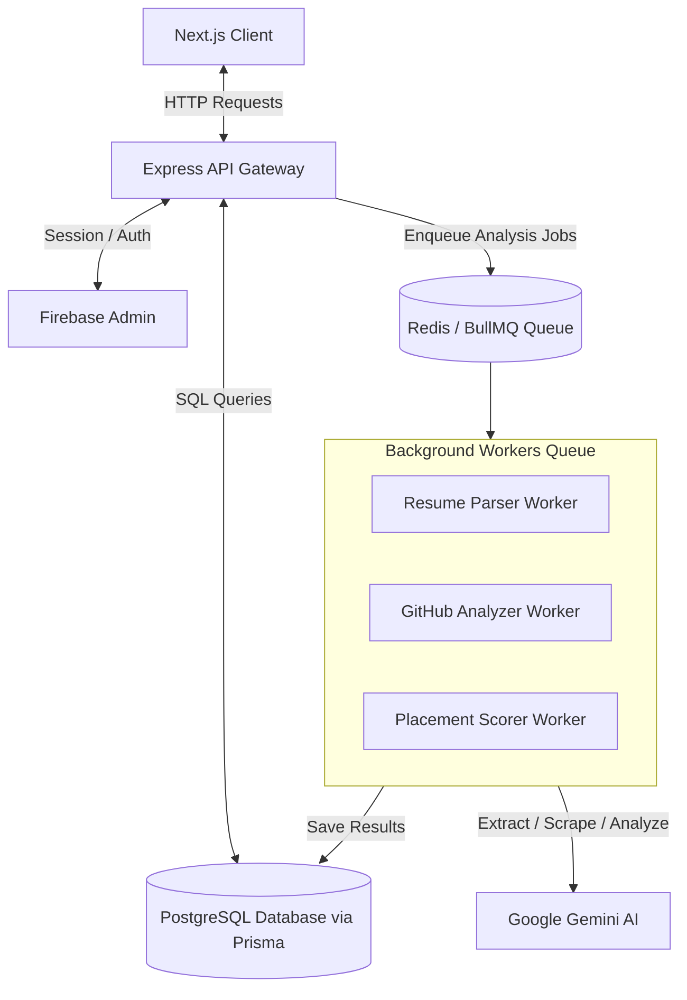

# PlacementIQ 🚀

An AI-powered Placement Preparation and Candidate Readiness Analytics Platform. **PlacementIQ** analyzes a candidate's GitHub repositories, LeetCode profile, and resume using advanced AI models to calculate placement readiness scores, provide detailed gap analyses, recommend jobs, and generate personalized learning roadmaps.

---

## 🌟 Core Features

- **AI Resume Parser**: Automatically extracts structure, experiences, education, and skills from PDF and Word resumes.
- **GitHub Profile Analyzer**: Analyzes repository structures, commit history, coding style, and project complexities.
- **Coding Profiles Evaluator**: Evaluates coding performance and streaks across LeetCode, HackerEarth, etc.
- **Placement Scorer**: Generates readiness scores mapped to industry-specific target roles using Google Gemini models.
- **Personalized Roadmaps**: Produces targeted roadmaps and gap analyses to help students master weak topics.
- **Job Recommender**: Intelligent recommendation system matching candidate profiles against current job opportunities.

---

## 🛠️ Technology Stack

PlacementIQ is built using a modern Monorepo structure, consisting of a **Next.js frontend** and an **Express/TypeScript backend**.

### 💻 Frontend (Web Client)
- **Framework**: [Next.js 14](https://nextjs.org/) (App Router, React 18)
- **Styling**: [Tailwind CSS](https://tailwindcss.com/) & [PostCSS](https://postcss.org/)
- **State Management & Caching**: [TanStack React Query v5](https://tanstack.com/query/latest)
- **Animations**: [Framer Motion](https://www.framer.com/motion/)
- **Forms & Validation**: [React Hook Form](https://react-hook-form.com/) & [Zod](https://zod.dev/)
- **UI Components**: [Radix UI](https://www.radix-ui.com/) Primitives & [Lucide React](https://lucide.dev/) Icons
- **Data Visualization**: [Recharts](https://recharts.org/) (for dashboard analytics & scoring metrics)
- **Notifications**: [Sonner](https://sonner.dev/) (elegant toasts)
- **Theme Manager**: [Next Themes](https://github.com/pacocoursey/next-themes) (Dark/Light mode support)

### ⚙️ Backend (API Server)
- **Runtime & Language**: [Node.js](https://nodejs.org/) & [TypeScript](https://www.typescriptlang.org/)
- **Server Framework**: [Express](https://expressjs.com/)
- **AI Core**: [Google Gemini SDK (`@google/generative-ai`)](https://ai.google.dev/)
- **Database & ORM**: [PostgreSQL](https://www.postgresql.org/) managed through [Prisma ORM](https://www.prisma.io/)
- **Task Queue & Background Jobs**: [BullMQ](https://bullmq.io/) (backed by [Redis / ioredis](https://redis.io/))
- **File & Media Storage**: [Cloudinary SDK](https://cloudinary.com/) (uploads) & [Firebase Admin SDK](https://firebase.google.com/docs/admin) (authentications)
- **Document Parsers**: [Mammoth](https://github.com/mwilliamson/python-mammoth) (Word Docs) & [PDF-Parse](https://github.com/adrianarroyocalle/pdf-parse) (PDF resumes)
- **Structured Logging**: [Pino](https://github.com/pinojs/pino) & [Pino-HTTP](https://github.com/pinojs/pino-http)

---

## 🏗️ Architecture Design

PlacementIQ uses a decoupled API-first design where compute-heavy analyzer tasks (Resume Parsing, GitHub Analysis, Score Calculations) are delegated to background worker queues using BullMQ.



---

## 🚀 Getting Started

### Prerequisites
- Node.js (v18+)
- PostgreSQL Database
- Redis Server (for background queues)
- Firebase Project setup
- Cloudinary Account
- Gemini API Key

### Installation

1. Clone the repository:
   ```bash
   git clone https://github.com/tramsai09-tech/PlacementIQ-prototype-.git
   cd PlacementIQ-prototype-
   ```

2. **Setup Backend**:
   ```bash
   cd Backend
   npm install
   # Create a .env file and fill in required keys (refer to env.ts config schema)
   npx prisma db push
   npm run dev
   ```

3. **Setup Frontend**:
   ```bash
   cd ../frontend
   npm install
   # Create a .env.local file with your configuration
   npm run dev
   ```

---

## 📄 License
This project is private and proprietary. All rights reserved.
